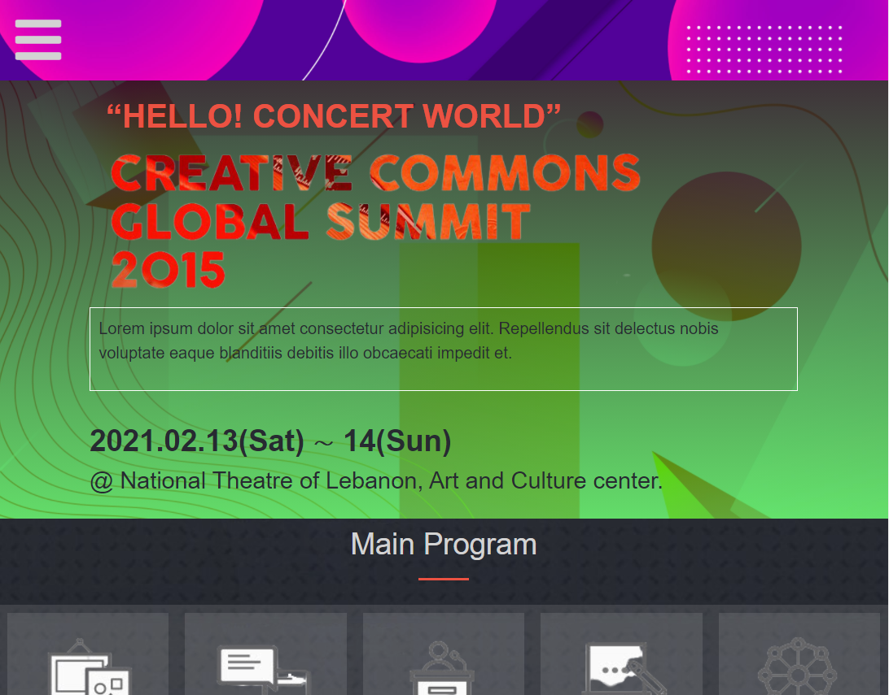

# Concert Hub

> Concert creative worlwide is an entertainment outfit that organises all kinds of shows

Creative creative worlwide is a fictitious company that organises various kinds of entertainment event. This website is a place for individuals to get their tickets, pay for the ticket and buy food for themselves before coming to the event. This site seeks to make booking, selecting an event to attend and getting refreshment hassle free. 

## Built With

- HTML, CSS and Javascript
- Bootstrap
- SASS

## Live Demo

[Live Demo Link](https://chrystalme.github.io/concert-hub/)

## Getting Started

**This is an example of how you may give instructions on setting up your project locally.**
**Modify this file to match your project, remove sections that don't apply. For example: delete the testing section if the currect project doesn't require testing.**

To get a local copy up and running follow these simple example steps.
    - make sure you have node installed
    - copy the repository and install it on your local machine

### Prerequisites
    - Bootstrap 5

## Authors

👤 **Author1**

- GitHub: [@chrystalme](https://github.com/chrystalme)
- Twitter: [@afam_ifeanyi](https://twitter.com/afam_ifeanyi)
- LinkedIn: [LinkedIn](https://linkedin.com/afam-ifeanyi-chrys-malieze-63876576)

## 🤝 Contributing

Contributions, issues, and feature requests are welcome!

Feel free to check the [issues page](issues/).

## Show your support

Give a ⭐️ if you like this project!

## Acknowledgments

- [FreeLogoDesign](https://freelogodesign.org)
- Inspiration
    -[Cindy](https://behance.net/adagio07)

## 📝 License

This project is [MIT](https://mit-license.org) licensed.
